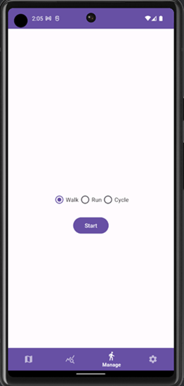
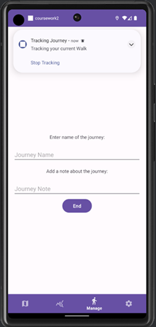
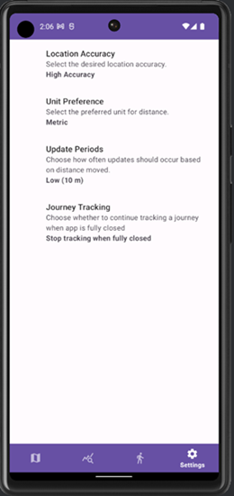

# Fitness Tracker App

## Project Description
An Android fitness tracking app to monitor journeys with real-time tracking, detailed statistics, and geofencing notifications.

### Key Features
- **Journey Tracking:** Track and save journeys with live updates on the map
- **Statistics Overview:** View statistics for journeys and filter them with the provided options
- **Geofencing Alerts:** Get notified when entering specific areas
- **Google Maps Integration:** Display and interact with a map


### Developed Using


## Setup & Installation
The project can be cloned & ran on an emulator or physical device

### Setup Permissions
You will need to grant permissions for the app to function correctly

### Setup Google Maps SDK
- Visit the [Google Cloud Console](https://cloud.google.com/cloud-console)
- Login and click **Go to my console**
- Create a new project and call it whatever you like
- Enable the **Google Maps SDK for Android**
- Generate an API key


When you first open the folder in Android Studio, a **local.properties** file should be created. If not, create this file.
- Add the API Key as follows: ```MAPS_API_KEY = YOUR_API_KEY```
- Replace the ```YOUR_API_KEY``` with the API key generated in the Google Cloud Console
- Save the file and close it

The app should now function properly, so you can run it.


## The Project
On an emulated device, this app will not work properly as it's not physical and able to have it's location tracked. You can set your location in it's settings and use a GPX/KML file to simulate a journey
### Map Screen

- Once the map loads, press the icon top right to go to your current location
- You can search for a location at the top search bar
- Click a location on the map and then add a Geofence by clicking the icon bottom right
- You can enter a name, note, and classification (Neutral, Good, Bad) for the Geofence


### View Journey Stats
Head to the stats screen, which is the 2nd icon on the navbar at the bottom


- You can see the total stats at the top of the screen, and edit the filters accordingly
- The map will show you most recent journey, or a default map if you do not have one.
- Use the **View All Previous Travels** button to see your journey history.


MORE IMAGES

### Journey Tracking
Start a Journey in the **Manage** Screen, where you choose whether the journey will be a walk, run, or cycle and then press 
the Start button





### Settings
Displays the settings options for the app, specifically the tracking
- **Location Accuracy:** Set the accuracy for the location, a higher accuracy may cause battery to run out faster
- **Unit Preference:** Decide which units you would prefer for displaying distance - metric or imperial
- **Update Periods:** Decide how often updates of your location on the map should occur, it is based on the distance moved
- **Journey Tracking:** Decide if you want the app to continue to track you when the app completely closed or not





